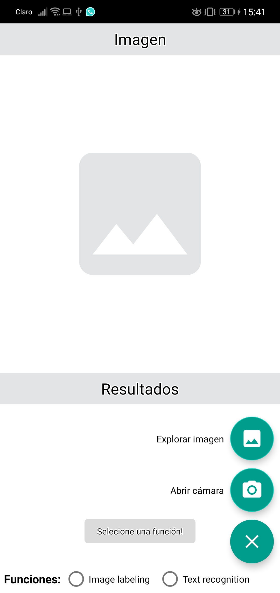

# ML-KIT-DE-GOOGLE
IMPLEMENTACIÓN DE LAS FUNCIONALIDADES DE LA ML KIT DE GOOGLE
<h1>ML KIT de Google</h1>
cuando el usuario ingresa aparecerá lo siguiente:  
 
el usuario tiene la opción de abrir una imagen de galería o abrir la cámara: 
 
Reconoce el Texto: 
 
Reconoce la imagen: 
 
reconoce objecto de una foto desde la cámara: 
 
